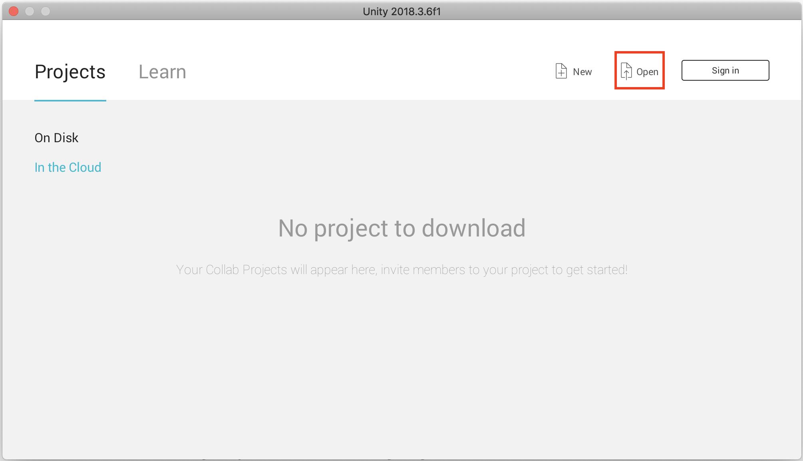
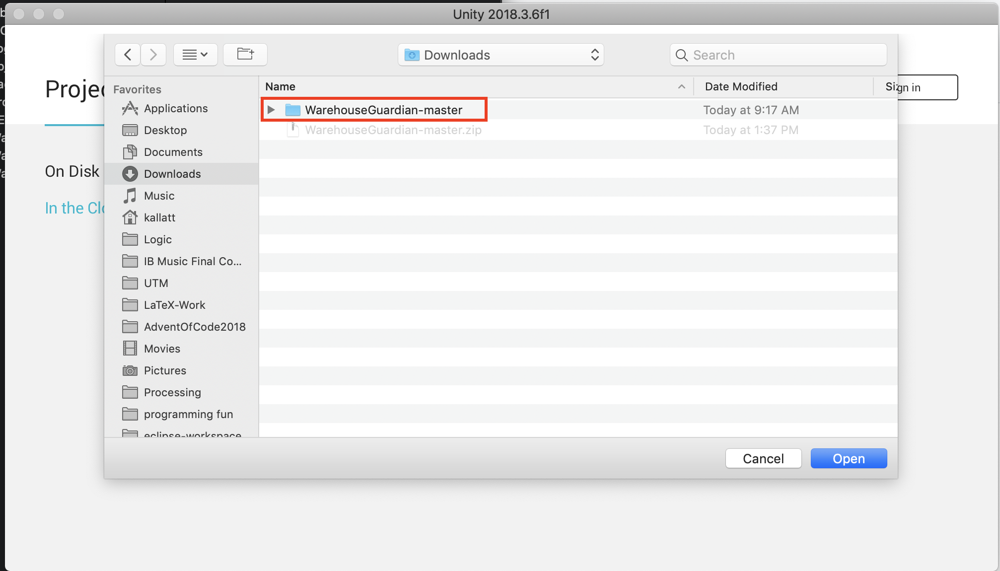
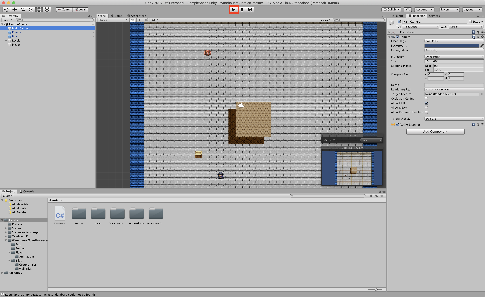

# WarehouseGuardian
CSC290 Coding Assignment - Warehouse Guardian - Sokoban Clone

Team Members: 
- Keith A
- Kimberly C
- Ahmad T
- Raghav D
- Danny R

This is the code repository for the Unity based project named Warehouse Guardian.

## Warehouse Guardian

## Installation

### Prerequisites
Unity download &rightarrow; https://store.unity.com/download?ref=personal

We recommend using Mac OS X or Windows OS for this project. 

### Download 
Download our source code via GitHub &rightarrow; https://github.com/keithallatt/WarehouseGuardian/archive/master.zip

OR

Download our source code via Command Line:

```
git clone https://github.com/keithallatt/WarehouseGuardian.git
```

### Open the file

Once Unity is downloaded and open, the first dialog to pop up will ask the user to open a project. To open our project, click on the open button.



Select our project from your downloads or wherever you've downloaded our project.



Once the project opens, (Unity projects take time to open. Give it a few minutes) click on the 'Play' button and enjoy!




## How to play

### Controls

Users can control the main player avatar using the arrow keys (&uparrow;, &downarrow;, &leftarrow;, &rightarrow;) or the W, A, S, D keys. Players can interact with various objects such as boxes and enemies. 

|              | Button            | Alternate      |
|--------------|-------------------|----------------|
| Move up      | <kbd>up</kbd>     | <kbd>W</kbd>   |
| Move left    | <kbd>left</kbd>   |  <kbd>A</kbd>  |
| Move right   | <kbd>right</kbd>  |  <kbd>S</kbd>  |
| Move down    | <kbd>down</kbd>   |  <kbd>D</kbd>  |

### Objective

Your objective is to get each box to a box endpoint. If you don't get them to the endpoint by the end of the night, you'll lose your job!

But be careful! There are dragons patrolling the warehouse! The dragons are bullies that will push you around and mess up your progress. Make sure to avoid them!


